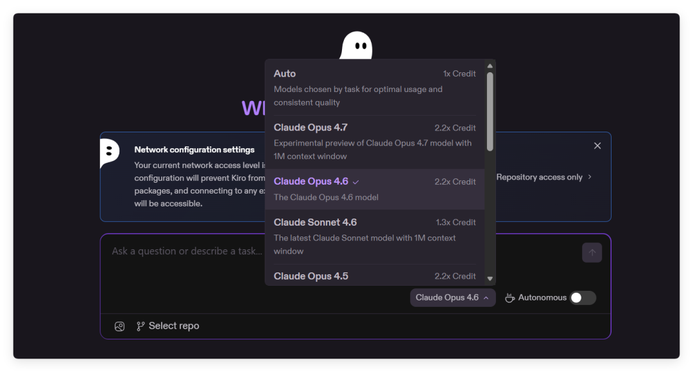
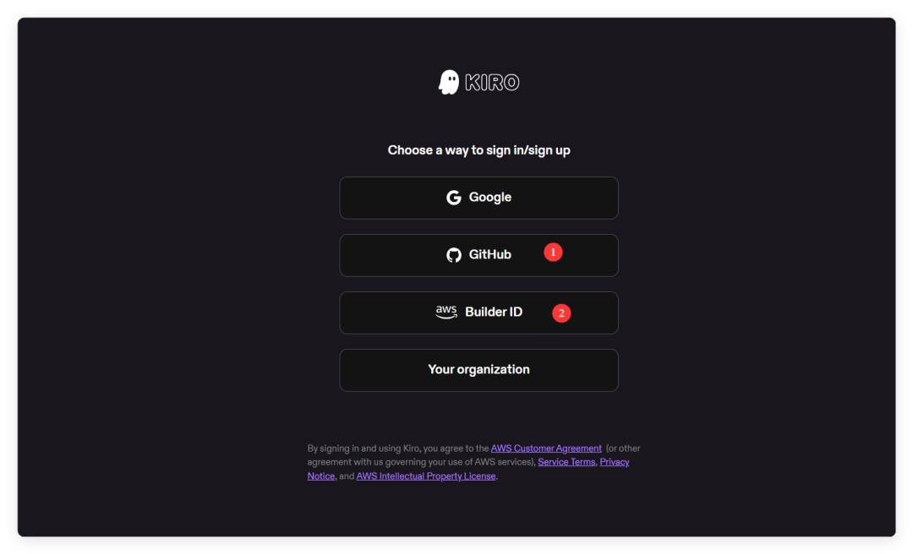
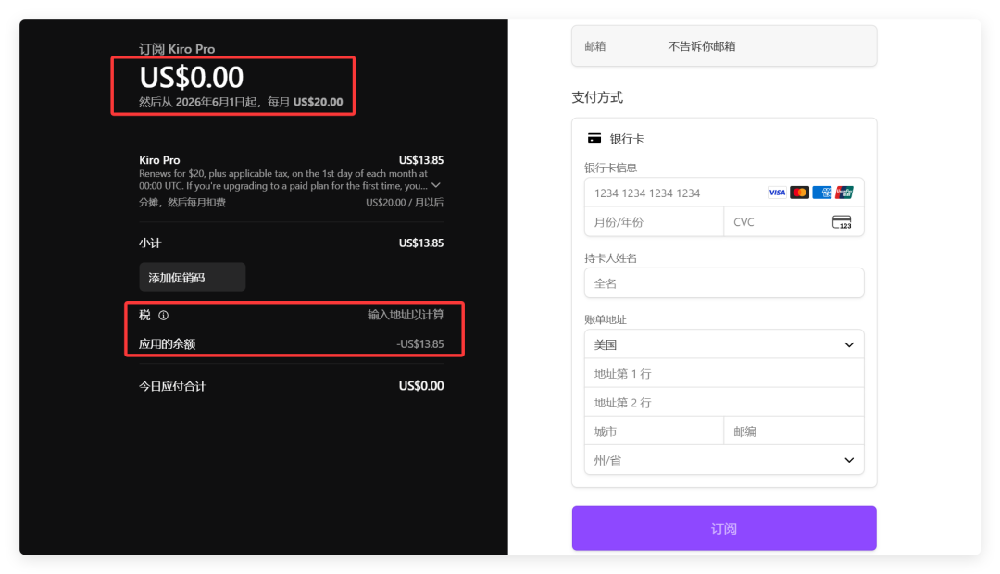
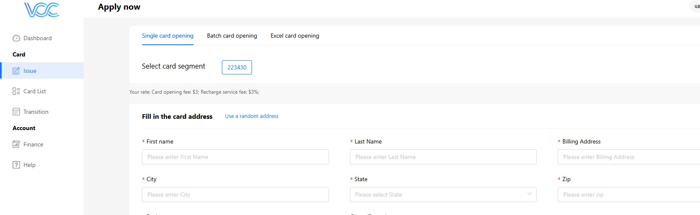
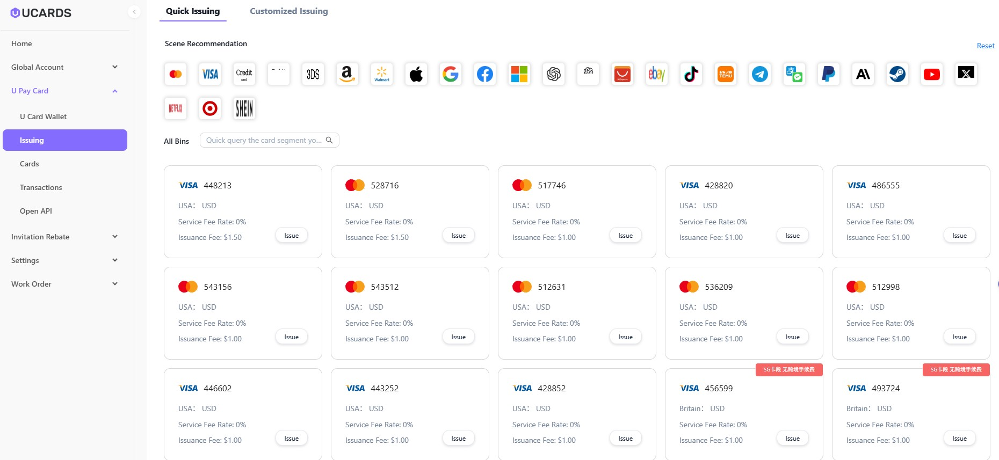

# The Best Virtual Credit Card (VCC) for Paid Subscriptions: Kiro Pro

Many users may not yet be aware that Kiro is currently running a promotion offering $20 in credits. Upon signing up, you will receive a $20 credit balance, which is automatically applied when paying with a Visa card to upgrade to a Kiro Pro membership. The platform supports models such as Claude Opus 4.7 and 4.6, along with previous-generation Chinese models like GLM5, MiniMax 2.5, and DeepSeek3.2.

The allowance is 1,000 Credits and expires on June 1. Strictly speaking, it can only be used in May, so it doesn't cover a full calendar month.

Now, let's walk through the steps. You can sign up using your GitHub or Amazon account, but please ensure you haven't already registered with it.

Once you're in, click "Upgrade Plan" and select Kiro Pro. You'll then see that the total due is $0, as the cost has been offset by a prorated credit for the remaining 20 days. All you need to do now is enter your Mastercard or Visa card details on the right.

If you don't have a Mastercard or Visa, or if you're looking to create multiple accounts, you can use a virtual credit card (VCC) platform. I recommend a few reliable VCC providers here. Once you've signed up, you can contact their customer support to confirm whether their cards support Kiro subscriptions.

**HLCard：[https://www.hlcard.net/register?code=FC096115](https://www.hlcard.net/register?code=FC096115)**

**UCARDS：[https://dash.ucards.cc/user/register?inviteCode=XCFZFS](https://dash.ucards.cc/user/register?inviteCode=XCFZFS)**

